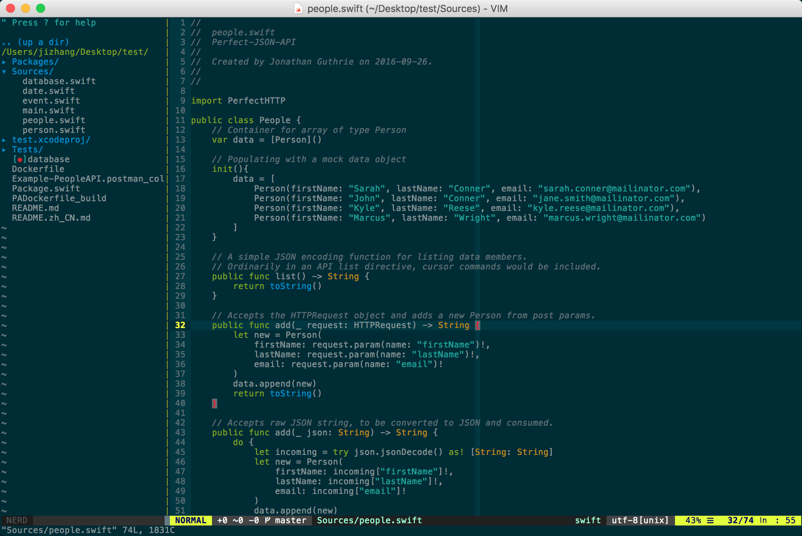

# Vim

### Install(Only for MacOS/Ubuntu)

```shell
git clone https://github.com/itrufeng/vim.git ~/.itrufengvim
ln -s ~/.itrufengvim/.vimrc ~/.vimrc
vim -c :PlugInstall
```

### Screenshot



### Dependents

* [MacVim](https://github.com/macvim-dev/macvim)
* [Vim8](https://vim.sourceforge.io)
* [Ack](https://github.com/petdance/ack2)
* [Ag](https://github.com/ggreer/the_silver_searcher)
* [CTag](http://ctags.sourceforge.net/)

### What plugin manager we used

* [Vim Plug](https://github.com/junegunn/vim-plug)

### Key Map

#### File

|Action|Key|Mode|
|---|---|---|
|Show/Hide Project Files|\\n|Normal/Insert|
|Open Quickly|^ + p|Normal|
|Open File Quickly|^ + d|CtrlP|
|Open Recent Quickly|\\e|Normal|
|Find file in Tree|\\j|Normal|
|Swich .h/.m|\\of|Normal|
|Swich .h/.m into a right window|\\ol|Normal|
|Swich .h/.m into a right new window|\\oL|Normal|
|Swich .h/.m into a left window|\\oh|Normal|
|Swich .h/.m into a left new window|\\oH|Normal|
|Swich .h/.m into a top window|\\ok|Normal|
|Swich .h/.m into a top new window|\\oK|Normal|
|Swich .h/.m into a bottom window|\\oj|Normal|
|Swich .h/.m into a bottom new window|\\oJ|Normal|

#### Search

|Action|Key|Mode|
|---|---|---|
|Search In Project By Ack|\\f|Normal|
|Search Objective-C In Project|\\fo|Normal|
|Search Swift In Project|\\fs|Normal|
|Search Python In Project|\\fp|Normal|
|Search Java In Project|\\fj|Normal|

#### Move

|Action|Key|Mode|
|---|---|---|
|Move A Line UP|⌥ + j|Normal/Insert/Visual|
|Move A Line Down|⌥ + k|Normal/Insert/Visual|
|Easy Moving|\\\\s|Normal|

#### Code

|Action|Key|Mode|
|---|---|---|
|Copy|^ + c|Visual|
|Paste|^ + v|Insert|
|Comment|\\cc|Normal|
|HTML Emmet|^ + y,|Normal|

#### Window

|Action|Key|Mode|
|---|---|---|
|Window Tab Forward|\\]|Normal|
|Window Tab Back|\\[|Normal|
|Jump To Up Window|^ + j|Normal|
|Jump To Down Window|^ + k|Normal|
|Jump To Left Window|^ + h|Normal|
|Jump To Right Window|^ + l|Normal|
|Save and Quit|\\w|Normal/Insert|
|Quit|\\q|Normal/Insert|
|Increase Vertical|\\>|Normal|
|Decrease Vertical|\\<|Normal|
|Increase Horizontal|\\+|Normal|
|Decrease Horizontal|\\-|Normal|
|Open Terminal|\\F11|Normal|
|Close Terminal|^ + d|In Terminal|

#### Cucumber

|Action|Key|Mode|
|---|---|---|
|Jump to steps define|^ + wd|Normal|


### Reference

* [VimAwesome](http://vimawesome.com)


